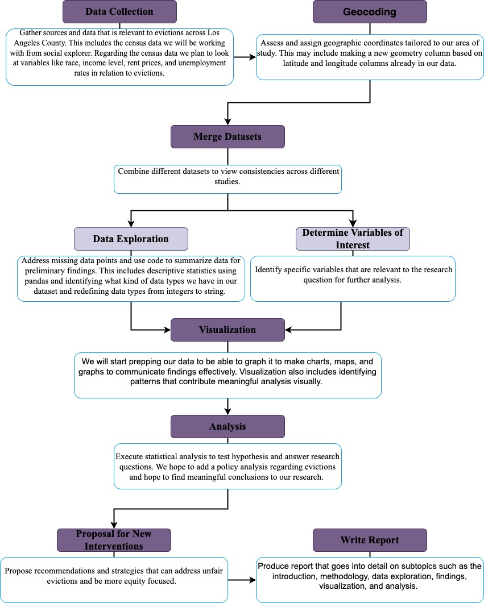

# Eviction in LA County 

## Research Question
We plan to carry an analysis of the City of Los Angeles eviction rates over time and across neighborhoods so we can understand some of the crucial temporospatial patterns of evictions across different demographics. An analysis of temporal and spatial variation in eviction rates we try to answer the question: How do eviction rates vary across temporal periods within Los Angeles County? What spatial patterns emerge from these eviction rates and how they changed over time for instance a look from 2010 to 2018 period, the pandemic period, and post pandemic period? How have eviction rates changed for specific demographic groups and communities (White, Hispanic, Black, Asian)? How do eviction trends intersect with prevailing understandings of racism, classism, and other forms of inequality? By addressing these research questions, we hope to contribute insights into the temporospatial dynamics of eviction.
 
## Background:
Our research show that recent eviction data from Los Angeles Housing Department (LAHD) recorded 71 429 eviction notices from February 2023- November 2023, 5 902 notices were filed for the month of November only, 96% of eviction notices were for “non -payment of rent”, 91% came with a 3-day notice, and $3760 was the average amount of rent that was owed by tenants (lacity, 2024). Researchers highlight that individual and neighborhood level sociodemographic factors correlate with eviction, and the uneven distribution of socioeconomic characteristics and housing conditions across neighborhoods likely produces patterns of spatial clustering in eviction (Nelson et al, 2021).

People have long classified the constellation of phenomena that drive eviction rates, displace communities, and contribute to homelessness as gentrification. As we develop deeper understandings of this issue, it is becoming clear that the causative factors and impacts of gentrification are driven by the structures and histories of racial capital. Disproportionate impacts on Black and Brown communities, lasting impacts of racial segregation, and differential access to real estate capital are but a small subset of consequences pointing to this connection. Rising eviction rates represents an important area of study as a potential impact of gentrification and a driver of increasing homelessness. By exploring geospatial data related to eviction, we hope to elucidate some of these relationships in order to better understand how eviction works and what might be its role in gentrification.

## Spatial Scope:
Our research dives deep into the neighborhoods of Los Angeles County, going beyond just the city. We want to understand how eviction challenges differ in various communities across this vast county. We recognize that different neighborhoods and regions may experience unique challenges related to eviction, and our spatial analysis seeks to address this nuance. The choice of Los Angeles County as our primary focus is intentional and allows us to examine the socioeconomic, cultural, and geographic diversity, presenting an ideal landscape for understanding the factors contributing to eviction rates. 

We also plan to look at a 10-year period—while specifically looking at the changes before and after COVID-19. This timeframe is important for understanding how eviction risks change over time, especially with the rise of unaffordable housing and pauses on rent during the pandemic.

## Data Sources 
**Source:** Eviction Lab
**Source Link:** -[https://data-downloads.evictionlab.org/#demographics-of-eviction-data/](https://data-downloads.evictionlab.org/#demographics-of-eviction-data/).
**Description:** The Eviction Lab provides a comprehensive dataset on eviction demographics, encompassing information such as eviction rates, demographic details of affected populations, and socio-economic factors.
**Collection Method:** The Eviction Lab aggregates data from various sources, including court records, government agencies, and other publicly available datasets. The data is then cleaned, processed, and standardized to provide a cohesive and reliable dataset.
 
 
**Source:** Urban Displacement Project
**Source Link:** [https://www.urbandisplacement.org/maps/california-estimated-displacement-risk-model/](https://www.urbandisplacement.org/maps/california-estimated-displacement-risk-model/)
**Description:** The California Estimated Displacement Risk Model from the Urban Displacement Project contributes insights into displacement risk, adding an additional layer to the analysis.
**Collection Method:** The Urban Displacement Project employs a combination of geospatial analysis, demographic data, and housing market indicators to estimate displacement risk. Their model considers factors such as rent increases, income changes, and neighborhood characteristics.
 
**Source:** GitHub Repository
**Source Link:** [https://github.com/urban-displacement/](https://github.com/urban-displacement/).
**Description:** The GitHub repository of the Urban Displacement Project provides open-source tools and datasets.
**Collection Method:** The Urban Displacement Project adopts a collaborative approach, allowing researchers and developers to access and contribute to their tools and datasets. This fosters transparency, peer review, and continuous improvement.
 
**Source:** U.S. Census Bureau
**Source Link:** [https://data.census.gov/profile/California?g=040XX00US06](https://data.census.gov/profile/California?g=040XX00US06).
**Source Link 2:**  [https://data.census.gov/profile/Los_Angeles_County,_California?g=050XX00US06037](https://data.census.gov/profile/Los_Angeles_County,_California?g=050XX00US06037)
**Description:** The U.S. Census Bureau provides a wealth of demographic and socio-economic data at various geographical levels, including county and city levels.
**Collection Method:** The U.S. Census Bureau conducts extensive surveys and collects data from various sources to provide comprehensive demographic, economic, and housing information. This data is regularly updated and covers a wide range of factors relevant to the study.
 
**Source:** MyNeighborhoodData
**Source Link:** [https://map.myneighborhooddata.org/?pa=75](https://map.myneighborhooddata.org/?pa=75).
**Description:** MyNeighborhoodData offers localized data on various social determinants of health, providing insights into community well-being.
**Collection Method:** MyNeighborhoodData aggregates data from public health agencies, government sources, and community organizations. It offers a platform for users to explore and analyze neighborhood-level data.
 
This multifaceted approach with data collection methodology ensures a robust foundation for our research, capturing the complexity of eviction dynamics in Los Angeles County.
 

## Methodology

## Conclusion
Our research, focused on eviction in Los Angeles County, aims to reveal insights into recent eviction trends over the last 10 years. By exploring spatial and temporal dimensions, we seek to conduct a risk assessment of vulnerable populations and regions, track trends from pre-pandemic to post-pandemic periods, and uncover correlations between eviction rates, gentrification, racialized policies, and social inequalities. Our approach integrates geospatial analysis and demographic insights with a goal of identifying intervention opportunities. We aim to research policy analysis regarding housing displacement through eviction data. After completing our analysis we hope to suggest new interventions where policies can better focus on equitable housing developments. Through our comprehensive spatial data analysis and demographic variables that we will analyze we hope to uncover impactful conclusions to evictions across Los Angeles County.  

## Reference 
Lacity. (2024). Summary and Analysis Eviction Notices (February - November 2023)
https://controller.lacity.gov/landings/evictions. Assessed on January 25, 2024
Kuang, J. (2023). Across California, eviction cases have returned to — or surpassed — pre-pandemic levels. https://calmatters.org/housing/homelessness/2023/11/california-evictions-post-pandemic/. Reported on November 20, 2023.
Mello, Felicia. (2024). As California evictions boom, whether tenants get lawyers depends on where they live. https://sacobserver.com/2024/01/as-california-evictions-boom-whether-tenants-get-lawyers-depends-on-where-they-live/ Reported January8, 2024
Nelson K, Gromis A, Kuai Y, Lens MC. Spatial Concentration and Spillover: Eviction Dynamics in Neighborhoods of Los Angeles, California, 2005-2015. Hous Policy Debate. 2021;31(3-5):670-695. doi: 10.1080/10511482.2020.1847163. Epub 2021 Jan 8. PMID: 38053756; PMCID: PMC10696918

